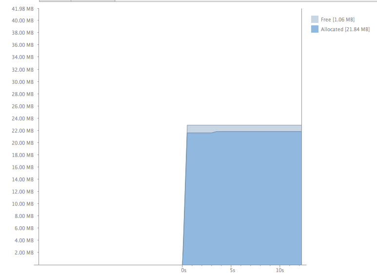
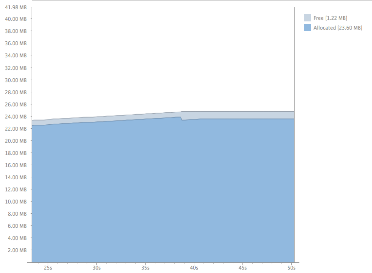
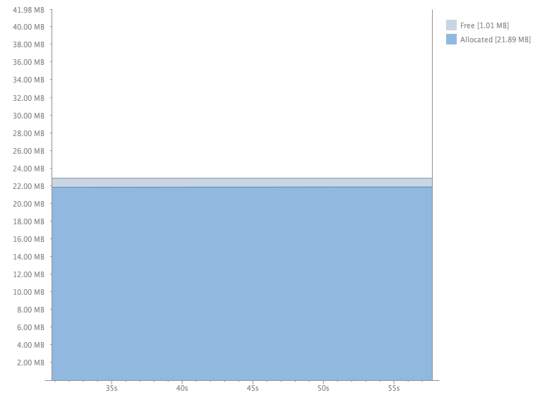
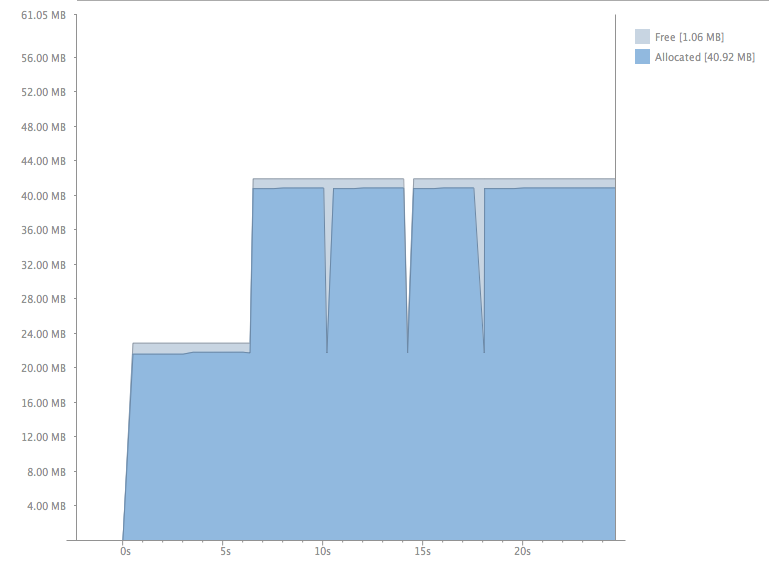
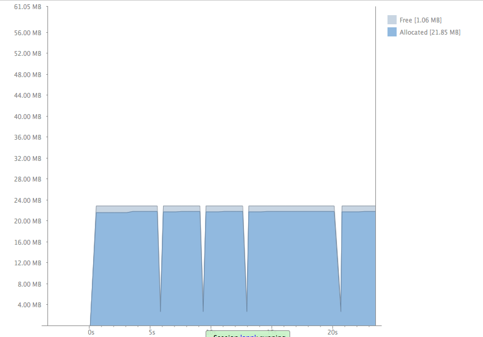
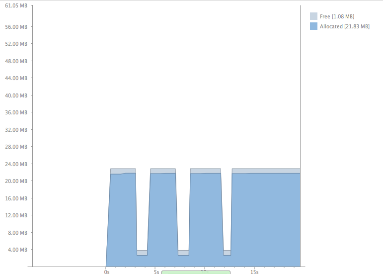
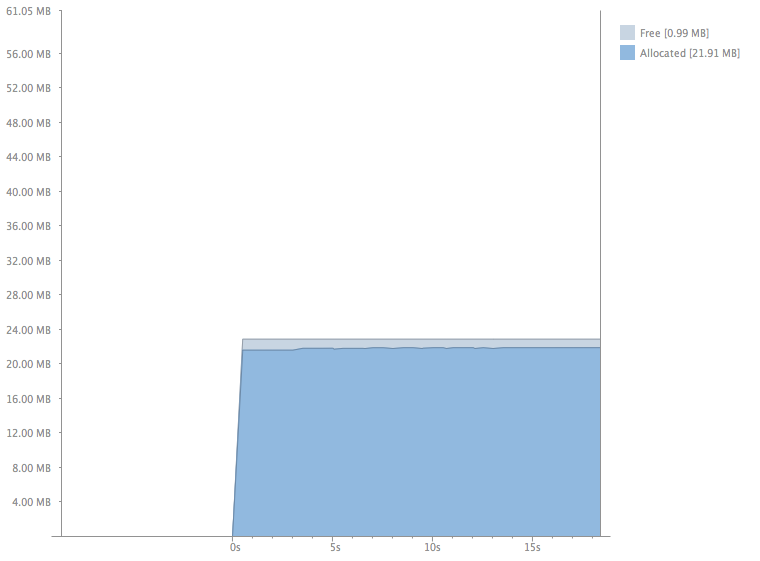

# Android Memory Test

The following describes a memory test that was attempted with a android device.

Device: ZTE Grand X

Android Version: 4.3

## Memory consumption

The [MainActivity](app/src/main/java/kyleilantzis/bigarray/MainActivity.java)
creates an integer array of 5 million elements which is approximately 20MB.

## Control test

With the MainActivity launched we can see a memory usage of 20MB which is as expected.



With a series of device rotations, more than 20, we can see memory increase.



In the log we can see we are not recreating our BigArrayHolder.

    D/MainActivity: onCreate
    D/MainActivity: last custom non configuration instance is a BigArrayHolder
    D/MainActivity: onStart
    D/MainActivity: onResume
    D/tcd: Focus to true
    D/tcd: process windowFocusChanged msg
    D/MainActivity: onPause
    D/MainActivity: onStop

The next is a series of home button presses followed by app icon presses on the home screen.



Memory increases but slower than device rotation. The most interesting test is the series of back button presses followed by app icon presses.



In the log we can see that a BigArrayHolder is created every time the app starts up again.

    D/MainActivity: onCreate
    D/MainActivity: creating new BigArrayHolder
    D/dalvikvm: GC_FOR_ALLOC freed 19626K, 5% free 22290K/23452K, paused 74ms, total 74ms
    I/dalvikvm-heap: Grow heap (frag case) to 42.183MB for 20000016-byte allocation
    D/MainActivity: onStart
    D/MainActivity: onResume
    D/tcd: Focus to true
    D/tcd: process windowFocusChanged msg
    D/MainActivity: onPause
    D/tcd: Focus to false
    D/tcd: process windowFocusChanged msg
    D/MainActivity: onStop
    D/MainActivity: onDestroy
    D/MainActivity: onCreate
    D/MainActivity: creating new BigArrayHolder
    D/dalvikvm: GC_FOR_ALLOC freed 19629K, 49% free 22290K/42984K, paused 27ms, total 27ms
    I/dalvikvm-heap: Grow heap (frag case) to 42.183MB for 20000016-byte allocation
    D/MainActivity: onStart
    D/MainActivity: onResume

It seems our first BigArrayHolder at time 0 is still alive and is never garbage collected. However, subsequent BigArrayHolders do get garbage collected after we press the app icon.
This is not acceptable as our app is taking double the needed memory to operate.

## Helping the garbage collector

In **onDestroy** we null out the BigArrayHolder

```java
@Override
protected void onDestroy() {
    super.onDestroy();
    Log.d(TAG, "onDestroy");
    mBigArrayHolder = null;
}
```

The series of rotation tests and home presses does not behave differently. However, interestedly the series of back button presses behaves as follows:



Now the app does not exceed 20MB unlike the control test. Note that the spikes of down to 2MB occurs when the app icon is pressed. While the MainActivity is destroyed but the app stays in the background memory remains at 20MB.

    D/MainActivity: onDestroy
    ...
    D/MainActivity: onCreate
    D/MainActivity: creating new BigArrayHolder
    ...
    D/dalvikvm: GC_FOR_ALLOC freed 19628K, 30% free 2759K/3924K, paused 69ms, total 69ms
    ...
    I/dalvikvm-heap: Grow heap (frag case) to 23.110MB for 20000016-byte allocation
    D/MainActivity: onStart
    D/MainActivity: onResume

## Forcing the GC

Let's attempt to force the GC so that when the MainActivity is destroyed the now unnecessary 20MB of memory does not remained claimed.

```java
@Override
protected void onDestroy() {
    super.onDestroy();
    Log.d(TAG, "onDestroy");
    mBigArrayHolder = null;
    System.gc();
}
```

The app behaves as desired; when the MainActivity is destroy the VM honors our GC request and memory drops to 2MB.



Now when the MainActivity is destroyed the BigArrayHolder is garbage collected. When the app returns from the background a new BigArrayHolder is created.

    D/MainActivity: onStop
    D/MainActivity: onDestroy
    D/dalvikvm: GC_EXPLICIT freed 19642K, 31% free 2731K/3924K, paused 7ms+2ms, total 57ms
    D/MainActivity: onCreate
    D/MainActivity: creating new BigArrayHolder
    D/dalvikvm: GC_FOR_ALLOC freed 8K, 31% free 2738K/3924K, paused 31ms, total 33ms
    I/dalvikvm-heap: Grow heap (frag case) to 23.091MB for 20000016-byte allocation
    D/MainActivity: onStart
    D/MainActivity: onResume

With the series of device rotations it the VM stills listens to our GC requests. The memory would go from 21.92MB before a rotation to 21.82MB, then back up to 21.92MB after the rotation completed.



    D/MainActivity: onPause
    D/MainActivity: onStop
    D/MainActivity: onRetainCustomNonConfigurationInstance
    D/MainActivity: onDestroy
    D/dalvikvm: GC_EXPLICIT freed 99K, 5% free 22342K/23452K, paused 2ms+3ms, total 24ms
    D/tcd: Focus to false
    D/MainActivity: onCreate
    D/MainActivity: last custom non configuration instance is a BigArrayHolder
    D/MainActivity: onStart
    D/MainActivity: onResume

The series of home button presses behaves like the control test.
